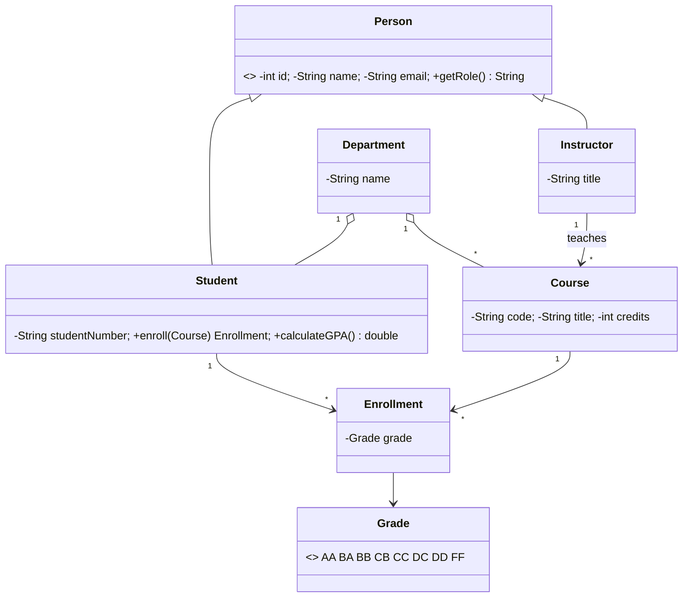

# Student Class Diagram -> Java Code

Maps a UML class diagram of a student system to Java.


```mermaid
classDiagram
    class Person { <<abstract>> -int id; -String name; -String email; +getRole() String }
    class Student { -String studentNumber; +enroll(Course) Enrollment; +calculateGPA() double }
    class Instructor { -String title }
    class Course { -String code; -String title; -int credits }
    class Enrollment { -Grade grade }
    class Department { -String name }
    class Grade { <<enumeration>> AA BA BB CB CC DC DD FF }
    Person <|-- Student
    Person <|-- Instructor
    Student "1" --> "*" Enrollment
    Course "1" --> "*" Enrollment
    Instructor "1" --> "*" Course : teaches
    Department "1" o-- "*" Student
    Department "1" o-- "*" Course
    Enrollment --> Grade
```

## Run
```
javac -encoding UTF-8 *.java && java Main
```
